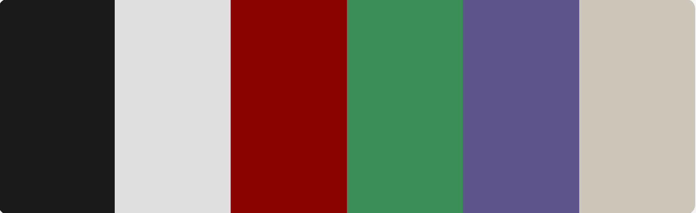

# This was the first thing I ever coded. Before I knew what GitHub was or what CSS meant.

Going to add this as a repo so I have it somewhere else other than a folder on my laptop, and so I can use it as another practice/demo site

## Colour Scheme

| Color Name        | Hex       |
|-------------------|-----------|
| Deep Dark Grey    | `#1a1a1d` |
| Pale Bone White   | `#e0dede` |
| Dark/Blood Red    | `#8b0000` |
| Sick/Necrotic Green | `#3b8d57` |
| Arcane Purple     | `#5e548e` |
| Dusty Bone        | `#ccc5b9` |

<!-- I'll make a pallette sheet and add it as an image in docs -->
